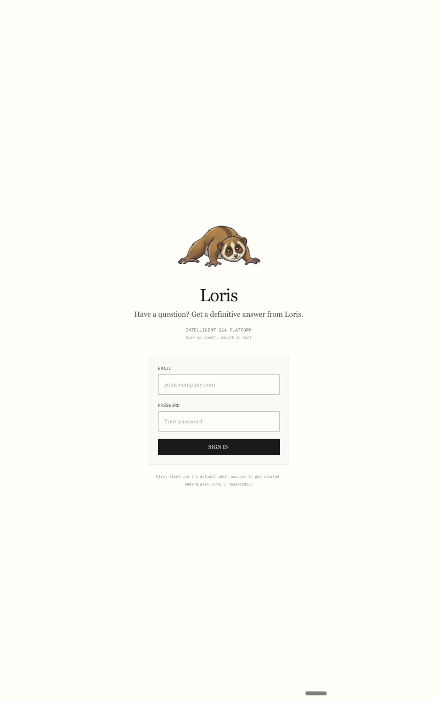
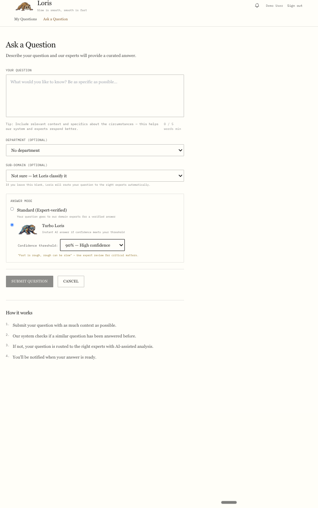
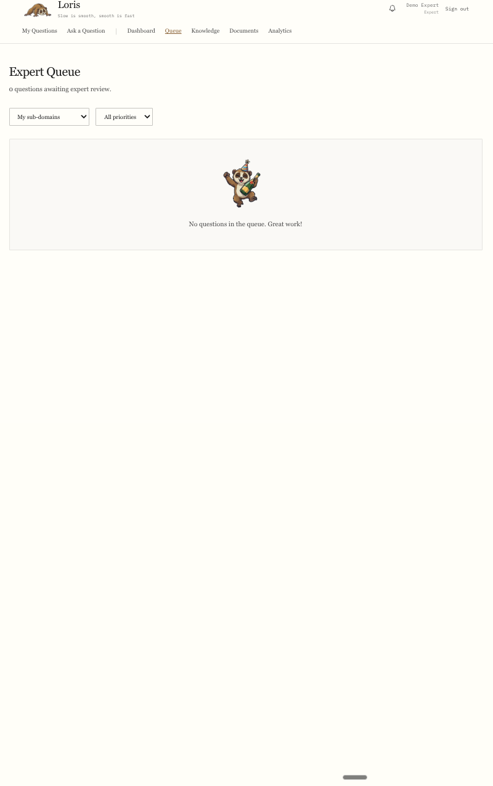
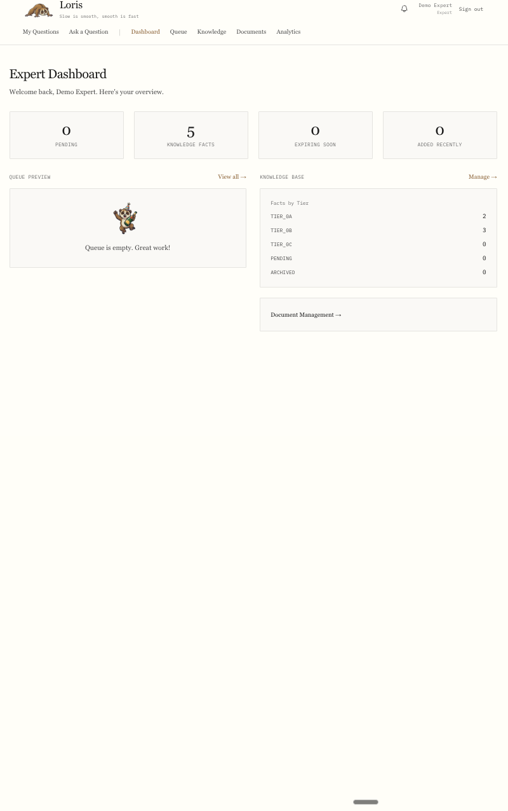
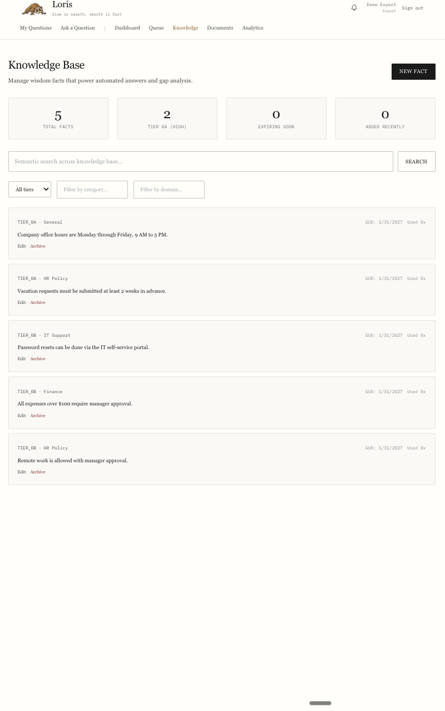
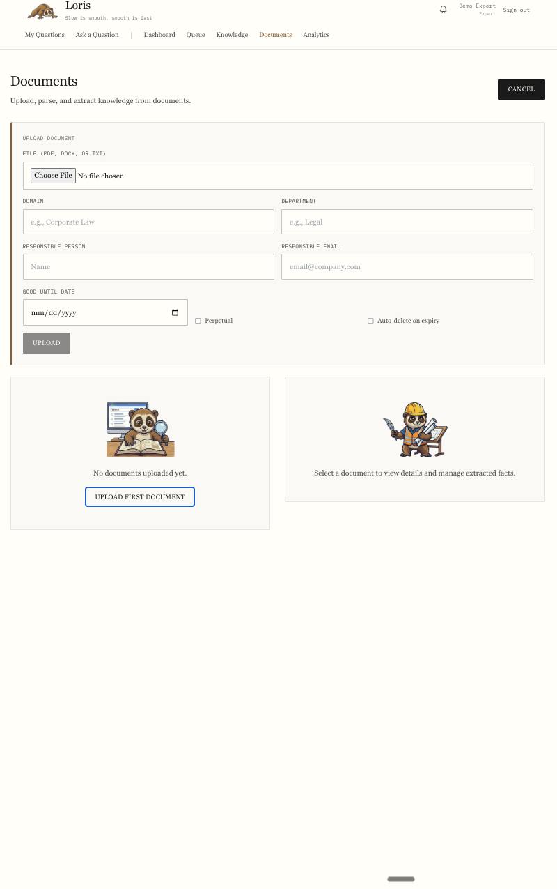
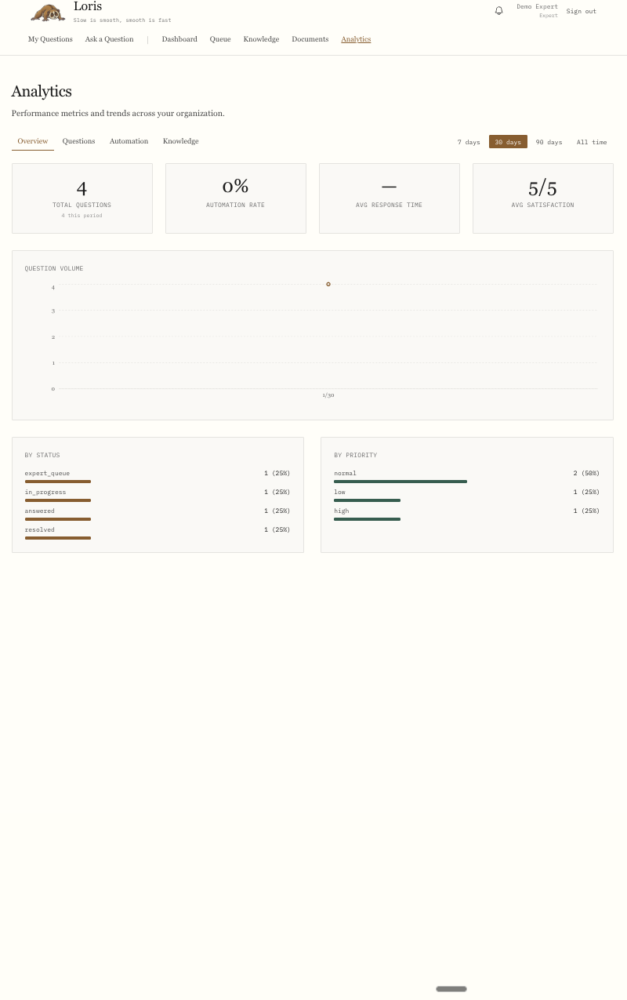
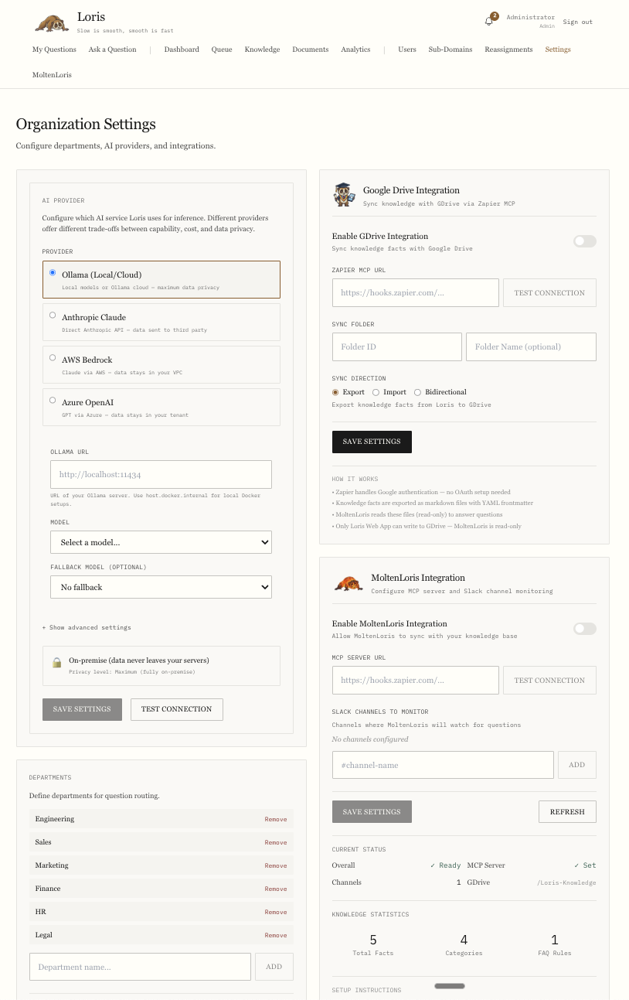

# Loris

**Intelligent Q&A Platform for Domain Experts**

<p align="center">
  
</p>

<p align="center">
  <em>"Slow is smooth, smooth is fast"</em>
</p>

<p align="center">
  <a href="#quick-start">Quick Start</a> &bull;
  <a href="#features">Features</a> &bull;
  <a href="#how-it-works">How It Works</a> &bull;
  <a href="#screenshots">Screenshots</a> &bull;
  <a href="#documentation">Documentation</a> &bull;
  <a href="#contributing">Contributing</a>
</p>

---

Loris connects business users with domain experts, delivering curated, expert-validated answers instead of search results. Think "Glean+" — not just finding documents, but providing actual answers.

Whether it's legal questions, HR policies, IT procedures, or any domain requiring expert knowledge — Loris routes questions to the right experts, builds institutional knowledge over time, and progressively automates answers to common questions.

## Features

<table>
<tr>
<td width="50%">

### Core Capabilities

- **Expert Queue** — Questions routed to domain experts with AI-assisted analysis
- **Progressive Automation** — Each answered question can become an automated response for future similar questions
- **Gap Analysis** — AI identifies what's covered by existing knowledge and what needs expert input
- **Knowledge Base** — Upload documents, extract facts, build organizational knowledge

</td>
<td width="50%">

### Advanced Features

- **Turbo Loris** — User-controlled fast-answer mode with confidence thresholds (50%/75%/90%)
- **MoltenLoris** — Autonomous Slack agent powered by your knowledge base
- **Sub-Domain Routing** — Questions routed by topic (AI or manual classification)
- **GUD Enforcement** — "Good Until Date" system expires stale content automatically

</td>
</tr>
<tr>
<td>

### Analytics & Insights

- **Metrics Dashboard** — Track automation performance, question trends, knowledge coverage
- **Expert Performance** — Response times, satisfaction ratings, workload distribution
- **Knowledge Coverage** — Identify gaps and track fact usage

</td>
<td>

### Enterprise Ready

- **Multi-Provider AI** — Ollama (local/cloud), Anthropic Claude, AWS Bedrock, Azure OpenAI
- **Data Privacy** — Local models keep data on-premise; cloud models use encrypted transport
- **Role-Based Access** — Business users, domain experts, and admins with appropriate permissions

</td>
</tr>
</table>

## How It Works

<table>
<tr>
<td width="25%" align="center">
<br>
<strong>1. Ask</strong><br>
<em>User submits question</em>
</td>
<td width="25%" align="center">
<br>
<strong>2. Check</strong><br>
<em>System checks for automation match</em>
</td>
<td width="25%" align="center">
<br>
<strong>3. Analyze</strong><br>
<em>AI performs gap analysis</em>
</td>
<td width="25%" align="center">
<br>
<strong>4. Answer</strong><br>
<em>Expert validates & delivers</em>
</td>
</tr>
</table>

### The Workflow

```
User asks question
        ↓
   Check automation rules ──→ Match found? → Auto-answer delivered
        ↓ no match                                    ↓
   Run gap analysis                            User accepts/rejects
        ↓                                             ↓
   Route to expert queue                    Rejected → Expert queue
        ↓
   Expert answers with AI assist
        ↓
   User receives answer
        ↓
   Expert can create automation rule → Future similar questions auto-answered
```

## Screenshots

### Login Page
*Clean login with Loris branding and default admin hint for first-time setup.*



---

### User Dashboard
*Business users see their questions with clear status indicators.*


---

### Ask a Question
*Submit questions with sub-domain selection, department, and Turbo Loris mode for instant AI answers.*



---

### Expert Queue
*Experts see pending questions with priority levels and sub-domain routing.*



---

### Expert Answer View
*AI gap analysis helps experts craft answers with relevant knowledge highlighted.*



---

### Knowledge Management
*Manage knowledge facts with tier classification and GUD (Good Until Date) tracking.*



---

### Document Management
*Upload documents, extract facts with AI, and manage document freshness.*



---

### Analytics Dashboard
*Track question trends, automation performance, and expert metrics.*



---

### Admin Settings
*Manage users, sub-domains, departments, and AI provider configuration.*



## Quick Start

### Prerequisites

- **Docker Desktop** — [Install Docker](https://www.docker.com/products/docker-desktop/)
- **Ollama** — [Install Ollama](https://ollama.ai) (runs on your host machine, not inside Docker)

### 1. Clone and Start

```bash
git clone https://github.com/Tucuxi-Inc/Loris.git
cd Loris

# Copy environment config (defaults work out of the box)
cp .env.example .env

# Start all services
docker-compose up -d
```

This starts four containers:

| Service | URL | Purpose |
|---------|-----|---------|
| Frontend | http://localhost:3005 | React app |
| Backend API | http://localhost:8005 | FastAPI REST API |
| API Docs | http://localhost:8005/docs | Swagger/OpenAPI interactive docs |
| PostgreSQL | localhost:5435 | Database with pgvector extension |
| Redis | localhost:6385 | Cache |

### 2. Pull Ollama Models

Ollama must be running on your host machine. The backend connects to it from Docker via `host.docker.internal`.

```bash
# Required: embedding model for automation matching (274 MB)
ollama pull nomic-embed-text

# Default inference model (runs on Ollama cloud - works on any machine)
ollama pull qwen3-vl:235b-cloud

# Fallback inference model
ollama pull gpt-oss:120b-cloud
```

**Cloud models** (names ending in `-cloud`) run on Ollama's infrastructure. Traffic is encrypted and prompts/outputs are not stored.

If you prefer fully local inference, edit `.env` and set `OLLAMA_MODEL` to any local model (e.g., `llama3.2`).

### 3. Verify

```bash
# Backend health check
curl http://localhost:8005/health
# Expected: {"status":"healthy","service":"loris-api"}

# Open the app
open http://localhost:3005
```

### 4. First Login

The database is seeded with a **default admin account**:

| Email | Password | Role |
|-------|----------|------|
| `admin@loris.local` | `Password123` | Admin |

**First steps after login:**
1. Go to **Settings** → Change the admin password
2. Go to **Users** → Create accounts for your team
3. Go to **Sub-Domains** → Define your knowledge domains
4. Go to **Knowledge** → Start building your knowledge base

### 5. Try the Workflow

1. Create a **business user** account and ask a question
2. Create a **domain expert** account
3. As the expert, go to **Queue**, assign the question, and answer it
4. As the user, see the answer and give a rating
5. As the expert, go to the answered question and click **"Create Automation Rule"**
6. As the user, ask a similar question — it gets auto-answered instantly
7. Check **Analytics** to see the automation metrics

## Tech Stack

| Layer | Technology |
|-------|------------|
| Backend | FastAPI, SQLAlchemy 2.0 (async), Pydantic v2 |
| Database | PostgreSQL 15 + pgvector |
| Cache | Redis 7 |
| Frontend | React 18, TypeScript 5+, Vite, Tailwind CSS |
| Charts | Recharts |
| Scheduler | APScheduler (in-process, daily GUD checks) |
| AI (Inference) | Ollama (local/cloud), Anthropic, AWS Bedrock, Azure OpenAI |
| AI (Embeddings) | Ollama nomic-embed-text (768 dimensions) |

## Project Structure

```
Loris/
├── backend/                    # FastAPI application
│   ├── app/
│   │   ├── main.py            # App factory, router registration
│   │   ├── api/v1/            # REST endpoints (auth, questions, knowledge, etc.)
│   │   ├── models/            # SQLAlchemy models (18+ tables)
│   │   ├── services/          # Business logic (automation, embedding, AI, etc.)
│   │   └── core/              # Config, database setup
│   └── Dockerfile
│
├── frontend/                   # React application
│   └── src/
│       ├── components/        # Reusable components (Layout, LorisAvatar, etc.)
│       ├── contexts/          # Auth state management
│       ├── pages/             # User, Expert, Admin pages
│       ├── lib/api/           # API clients
│       └── styles/            # Tufte-inspired design system
│
├── database/                   # PostgreSQL init scripts
├── docs/                       # Planning documentation
├── docker-compose.yml          # Container orchestration
└── .env.example               # Environment template
```

## API Endpoints

All endpoints documented at http://localhost:8005/docs after starting.

| Group | Prefix | Description |
|-------|--------|-------------|
| Auth | `/api/v1/auth` | Register, login, JWT tokens, profile |
| Questions | `/api/v1/questions` | Full Q&A lifecycle, expert queue, automation |
| Automation | `/api/v1/automation` | Rule CRUD, create from answered questions |
| Knowledge | `/api/v1/knowledge` | Facts CRUD, semantic search, gap analysis |
| Documents | `/api/v1/documents` | Upload, parsing, fact extraction |
| Analytics | `/api/v1/analytics` | Metrics, trends, performance |
| Notifications | `/api/v1/notifications` | In-app notification system |
| Users | `/api/v1/users` | User management (admin) |
| Sub-Domains | `/api/v1/subdomains` | Topic routing configuration |
| Org Settings | `/api/v1/org` | Organization configuration |

## Database

### Auto-Created Tables

Tables are auto-created on backend startup via SQLAlchemy. No manual migrations needed for fresh installs.

### Resetting the Database

```bash
docker exec loris-postgres-1 psql -U loris -d loris -c \
  "DROP SCHEMA public CASCADE; CREATE SCHEMA public; \
   CREATE EXTENSION IF NOT EXISTS \"uuid-ossp\"; \
   CREATE EXTENSION IF NOT EXISTS \"vector\";"
docker-compose restart backend
```

### Linux Note

On Linux, add this to the `backend` service in `docker-compose.yml`:

```yaml
extra_hosts:
  - "host.docker.internal:host-gateway"
```

## Development

### Rebuilding After Changes

```bash
# Rebuild backend
docker-compose up -d --build backend

# Rebuild frontend
docker-compose up -d --build frontend

# Restart frontend (for new .tsx files)
docker-compose restart frontend

# View logs
docker logs loris-backend-1 -f
```

### Running Without Docker

```bash
# Backend
cd backend
pip install -r requirements.txt
uvicorn app.main:app --host 0.0.0.0 --port 8000 --reload

# Frontend
cd frontend
npm install
npm run dev
```

Requires PostgreSQL with pgvector and Redis running locally.

### Admin Tools (Optional)

```bash
# Start with pgAdmin and Redis Commander
docker-compose --profile tools up -d

# pgAdmin: http://localhost:5055 (admin@loris.dev / admin)
# Redis Commander: http://localhost:8085
```

## AI Provider Configuration

Edit `.env` to switch AI providers:

| Provider | `AI_PROVIDER` value | Requires |
|----------|-------------------|----------|
| Ollama (default) | `local_ollama` | Ollama running on host |
| Anthropic Claude | `cloud_anthropic` | `ANTHROPIC_API_KEY` |
| AWS Bedrock | `cloud_bedrock` | AWS credentials configured |
| Azure OpenAI | `cloud_azure` | `AZURE_OPENAI_*` env vars |

## MoltenLoris (Slack Agent)

<p align="center">
  
</p>

MoltenLoris is an autonomous Slack-monitoring agent that uses your Loris knowledge base to answer questions in Slack channels.

**Key features:**
- Monitors configured Slack channels for questions
- Answers using your organization's knowledge base
- Escalates to human experts when uncertain
- Learns from expert corrections

**Setup:** See [MOLTENLORIS-SETUP-GUIDE.md](docs/loris-planning/MOLTENLORIS-SETUP-GUIDE.md) for complete instructions.

## Documentation

Detailed planning documents in `docs/loris-planning/`:

- [Project Vision](docs/loris-planning/01-PROJECT-VISION.md) — What we're building and why
- [User Personas](docs/loris-planning/02-USER-PERSONAS.md) — User journeys and use cases
- [System Architecture](docs/loris-planning/03-SYSTEM-ARCHITECTURE.md) — Technical architecture
- [Data Model](docs/loris-planning/04-DATA-MODEL.md) — Database schema
- [API Specification](docs/loris-planning/05-API-SPECIFICATION.md) — REST API details
- [Automation Workflow](docs/loris-planning/06-AUTOMATION-WORKFLOW.md) — Auto-answering logic
- [Migration Strategy](docs/loris-planning/08-MIGRATION-STRATEGY.md) — Implementation phases

## Contributing

We welcome contributions! Here's how to get started:

### Setting Up for Development

1. Fork the repository
2. Clone your fork: `git clone https://github.com/YOUR-USERNAME/Loris.git`
3. Create a branch: `git checkout -b feature/your-feature-name`
4. Make your changes
5. Run the app locally to test
6. Submit a pull request

### Code Style

- **Backend:** Follow PEP 8, use type hints, async/await patterns
- **Frontend:** TypeScript strict mode, functional components, Tailwind CSS
- **Commits:** Use conventional commits (feat:, fix:, docs:, etc.)

### Areas for Contribution

- **Tests** — Unit and integration tests (see `backend/tests/`)
- **Documentation** — Improve docs, add examples
- **UI/UX** — Design improvements, accessibility
- **Features** — Check GitHub Issues for feature requests
- **Bug Fixes** — Check GitHub Issues for reported bugs

### Reporting Issues

Please use [GitHub Issues](https://github.com/Tucuxi-Inc/Loris/issues) to report bugs or request features. Include:
- Steps to reproduce (for bugs)
- Expected vs actual behavior
- Environment details (OS, browser, Docker version)

## Meet the Loris Family

<table>
<tr>
<td align="center"><br><sub>Loris</sub></td>
<td align="center"><br><sub>TransWarp</sub></td>
<td align="center"><br><sub>Scholar</sub></td>
<td align="center"><br><sub>Thinking</sub></td>
<td align="center"><br><sub>Celebration</sub></td>
</tr>
<tr>
<td align="center"><br><sub>Molten</sub></td>
<td align="center"><br><sub>Detective</sub></td>
<td align="center"><br><sub>Architect</sub></td>
<td align="center"><br><sub>Confused</sub></td>
<td align="center"><br><sub>Alert</sub></td>
</tr>
</table>

## License

MIT License (with additions) — see [LICENSE](LICENSE) for details.

**Key points:**
- Free to use commercially, including as a standalone application
- Must rename if redistributing (cannot use "Loris" name for derivatives)
- Must provide attribution and link to license
- Contributors agree code may be used commercially by Tucuxi, Inc.

---

<p align="center">
  <strong>Built with care by <a href="https://github.com/Tucuxi-Inc">Tucuxi Inc</a></strong>
</p>
